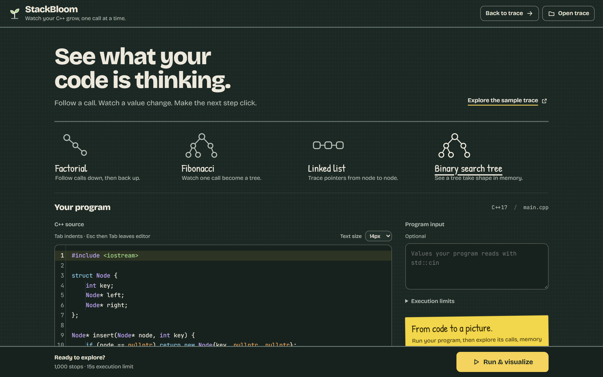
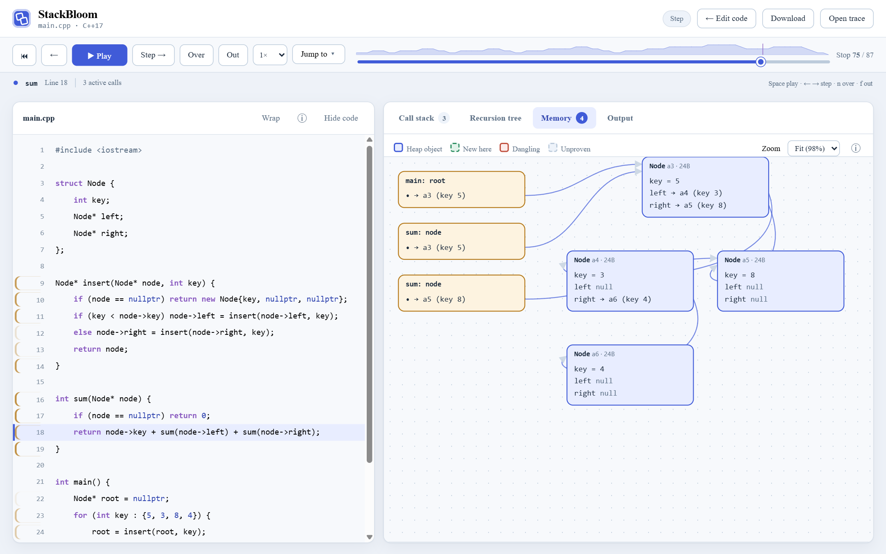
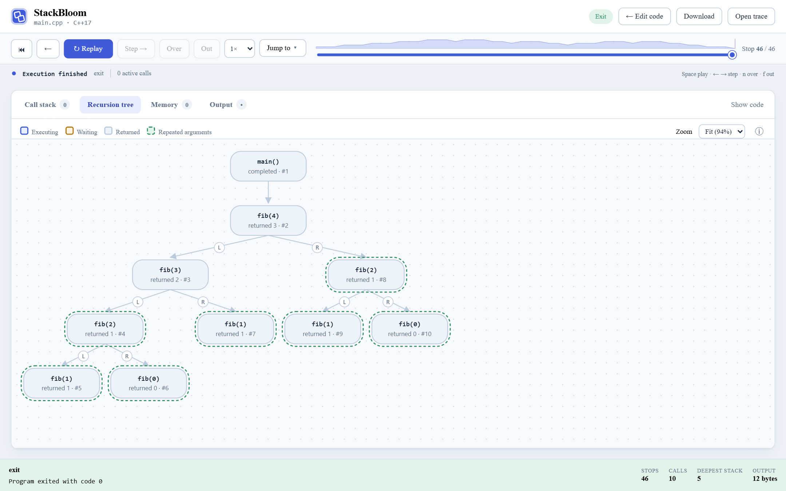

# 🌱 StackBloom

*Watch your C++ grow, one call at a time.*

StackBloom runs a single-file C++ program under GDB and turns it into something you
can step through: every source stop, every call frame with its typed locals, the
recursion as a branching tree, and the heap as a graph of real pointers.

Paste a program and press **Run & visualize**:



Then step through it. The source stays on the left while the call stack, recursion
tree, memory graph and output share tabs on the right, so nothing needs scrolling:



**Run only code you trust. This is not a sandbox** — your program runs on your machine
with your permissions.

## What it shows

- **Source stops and locals.** A stop happens *before* the highlighted line runs. Each
  call bubble carries its own locals, with standard library values (`std::string`,
  `vector`, `map`, smart pointers) shown as contents rather than internal layout.
- **Values that read like code.** Types are shortened (`std::vector<int>`, not the
  allocator-laden spelling), containers show an item count, and pointers name what
  they point at — `→ a4 (key 3)`, `→ root`, `null` or `✕ dangling` — instead of a hex
  address. A local whose declaration hasn't run yet shows *not set yet* rather than
  leftover memory. Hover any value for the raw debugger text and address.
- **A recursion tree.** Every invocation with the arguments it received and the value
  it returned. With two calls the first is the left branch (L) and the second the
  right (R), so `fib(n-1)` and `fib(n-2)` sit where you expect.

  

- **A memory graph.** Pointers, heap objects, aliases meeting at one box, cycles that
  loop back, and dangling pointers after `delete`. The shape is detected per stop —
  list, tree, grid or general graph — and nodes keep their position as you step.
- **Time travel.** Step forward and back, jump to the next memory change or the next
  output, or drag the timeline. Replay never re-runs your program; it only reads what
  was recorded.
- **Watch it unfold.** Play or pause the trace at 0.5×, 1× or 2× speed. Playback
  stops at the end, when you seek manually, or when the page becomes hidden.
  Press Space to play/pause outside form controls; arrow keys step through stops.
  Changed local values are highlighted when the trace includes stable call IDs.
- **The shape of the run.** A depth sparkline sits behind the scrubber, so recursion
  looks like a mountain range and a loop like a flat line; click it to jump. Line
  numbers warm up with how often the program stopped there, changed locals show what
  they were a moment ago, and edges into a new heap object draw themselves in. When a
  program finishes, a summary counts its stops, calls, deepest stack and heap objects.

The editor includes illustrated example choices and shows actual elapsed time while
compiling/tracing. The replay workspace colors C++ syntax and flags stops that change
memory or output. Light/dark appearance follows your system, and decorative motion
respects the reduced-motion setting.

Both graphs scale to fit their panel, but never below a legible size: past that they
scroll instead. Wide recursion trees switch to compact one-line nodes
(`insert(a4, 4) → a4`) and scroll to keep the running call in view. Pick a zoom level
from the dropdown to read the details, and **Hide code** gives the graph the whole
window. Each panel's explanation sits behind its ⓘ button, and **Wrap** folds long
source lines instead of scrolling sideways.

Read the [design and data flow](docs/design.md), the exact
[JSON trace schema](trace.schema.json), and the [phased roadmap](docs/roadmap.md).

## Install on Windows

### Portable: download, unzip, run

The Windows download carries everything StackBloom needs — the C++ compiler, the
debugger, Python and the viewer — so it runs on a PC with none of them installed.

1. Download `StackBloom-windows-x64.zip` from the
   [latest release](https://github.com/sumnoon/StackBloom/releases/latest) (about
   125 MB; 480 MB unpacked). Every build is also available from the
   [Windows portable bundle](https://github.com/sumnoon/StackBloom/actions/workflows/windows-bundle.yml)
   workflow's artifacts.
2. Extract it, open the `StackBloom` folder, and double-click **StackBloom.cmd**. Your
   browser opens on the editor.

Nothing is installed and nothing outside the folder changes; delete the folder to
remove it. The launcher puts only its own folder and Windows on `PATH`, so a
different compiler elsewhere on the machine can't interfere.

Two things to know:

- **Keep the folder at 130 characters or fewer**, such as `C:\StackBloom` or your
  Downloads folder. GCC opens its own headers through un-normalized paths and
  Windows stops at 260 characters, so from a deeper folder it can't find
  `<iostream>`. StackBloom checks this at start-up and says so.
- The launcher is not code-signed, so SmartScreen may warn on first run: choose
  **More info → Run anyway**.

To build the bundle yourself, see [Building the Windows bundle](#building-the-windows-bundle).

### From source, with MSYS2

This is the setup for working on StackBloom itself. You need a C++ compiler, a
Python-enabled GDB, Python 3 and Node.js. Tested on Windows 11.

**1. Install MSYS2** from [msys2.org](https://www.msys2.org/), then open the
**UCRT64** terminal and install the toolchain:

```sh
pacman -S --needed mingw-w64-ucrt-x86_64-gcc mingw-w64-ucrt-x86_64-gdb
```

**2. Put the toolchain on your PATH.** Add `C:\msys64\ucrt64\bin` to your user `Path`
(Settings → *Edit environment variables for your account*), then open a new terminal
and check that both tools answer, and that GDB has Python built in:

```sh
g++ --version
gdb -nx -batch -ex "python import sys; print(sys.version)"
```

If the last command prints nothing or errors, your GDB lacks Python; install the
MSYS2 one above rather than a plain MinGW build.

**3. Install Python 3.10+** from [python.org](https://www.python.org/downloads/)
(tick *Add python.exe to PATH*) and **Node.js 22.12+ or 24 LTS** from
[nodejs.org](https://nodejs.org/).

That is all the setup needed: `python stackbloom.py` installs the web dependencies and
builds the viewer on its first run.

A note specific to Windows: several programs ship their own copy of the C++ runtime
(Git for Windows is a common one). StackBloom passes the compiler's own directory
first when it runs your program, so it loads the runtime it was built against.

## Run with Docker (Linux, macOS or Windows)

The image carries the compiler, a Python-enabled GDB, Python and the built viewer,
so Docker is the only thing to install.

```sh
docker build -t stackbloom .
```

```sh
docker run --rm -p 127.0.0.1:8765:8765 stackbloom
```

Then open **http://127.0.0.1:8765**. Tagged releases also publish a ready-made image,
so after the first `v*` tag you can skip the build:

```sh
docker run --rm -p 127.0.0.1:8765:8765 ghcr.io/sumnoon/stackbloom
```

**Always write `127.0.0.1:` in `-p`.** A bare `-p 8765:8765` publishes the port on
every network interface, and anything that can reach it can compile and run code in
the container. The server also refuses requests whose `Host` isn't `127.0.0.1` or
`localhost`, which stops a browser on another machine, but not a determined client.

For a tighter box, this is the profile CI runs on every change — read-only root, no
capabilities, no privilege escalation, and memory and process limits. GDB needs no
extra capability, because it only traces its own child process:

```sh
docker run --rm -p 127.0.0.1:8765:8765 --read-only --tmpfs /tmp:rw,exec,nosuid,size=256m --cap-drop ALL --security-opt no-new-privileges --memory 1g --pids-limit 128 stackbloom
```

`/tmp` must allow `exec`: that is where your program is compiled and run. A container
narrows what a hostile program can reach, but it shares the host's kernel, so treat
it as a convenience, not a sandbox for untrusted code.

## Install on Ubuntu 22.04

```sh
sudo apt update
sudo apt install -y build-essential gdb python3 python3-venv
gdb -nx -batch -ex 'python import sys; print(sys.version)'
```

Use Node.js **22.12+ or 24 LTS**; Ubuntu 22.04's default Node package is too old for
this Vite setup. See [Vite's prerequisites](https://vite.dev/guide/).

## Run it

One command from the repository root:

```sh
python stackbloom.py
```

It builds the viewer if needed, serves it, and opens your browser at
**http://127.0.0.1:8765**. Press Ctrl+C to stop. There is one process and one port;
Node.js is used only for that build step, never to run the app.

`--port 9000` moves it, `--no-browser` skips opening a window, and `--skip-build` uses
the existing build as-is. `--host` changes the bind address; leave it at `127.0.0.1`
outside a container. Rebuilds happen automatically when the viewer's sources
change, so pulling new code needs no extra step.

Paste a single-file C++17 program into **C++ source**, add **Program input** if it reads
`std::cin`, and click **Run & visualize**. The cards at the top load ready-made
examples: factorial, Fibonacci, a linked list and a binary search tree.

- **Compile errors point at the code.** The editor has a line-number gutter, and when a
  program does not compile, the lines GCC complained about are marked in it. Each error
  is listed underneath; click one to jump to that line with the cursor at the column.
  The full compiler output is one click away.
- **Tab indents like a code editor.** Tab moves to the next 4-space stop, Tab and
  Shift+Tab indent or outdent every selected line, and Ctrl+Z undoes them. Press Esc,
  then Tab, to move focus out of the editor.
- **Limits you can change.** **Stop limit** (1,000 to 5,000) and **Time limit** (15 to 60
  seconds) cover programs that need more room, like `fib(12)` at about 1,600 stops.
- **Recent runs** keeps your last eight programs in this browser, named after their
  first function, so closing the tab doesn't lose work.

The trace opens on its own screen:

- **Step like a debugger.** **Step** moves to the very next stop, **Over** skips the calls
  the current line makes, and **Out** runs until the current call returns. The keys are
  GDB's own: `s`, `n` and `f`. Arrow keys step, and Space plays or pauses.
- **Run to a line.** Line numbers the program stopped at are clickable; each click goes
  to the next time that line runs.
- **Jump to** the deepest call, the next memory change or the next output.
- **Watch a variable.** Press **Watch** on any local in the call stack to pin it above the
  workspace, with its current value and a chart of how it changed across the run. Click
  the chart to jump there. Up to three at a time.
- **Keep or share a trace.** **Download** saves it as JSON; drop a trace file anywhere on
  the window, or use **Open trace**, to load one. Opening a trace never runs code.

The **Call stack**, **Recursion tree**, **Memory** and **Output** tabs sit beside the
source; arrow keys move between them once a tab has focus. **Hide code** gives a wide
graph the whole window, and **← Edit code** returns to your program with it still there.

The server listens only on `127.0.0.1`, serves the viewer only from `web/dist`, accepts
submissions only from its own origin with a custom request header, and runs one job at
a time. That stops unrelated web pages from submitting code; it does **not** contain
malicious C++. Never expose the server or put it behind a public tunnel.

### Working on the viewer itself

For hot reloading while editing the React code, run the tracer and Vite separately:

```sh
python tracer/server.py
```

```sh
npm --prefix web run dev
```

Then use **http://127.0.0.1:5173**, which proxies `/api` to the tracer on port 8765.

## Command line

Trace a program without the viewer:

```sh
python tracer/trace.py path/to/main.cpp --stdin path/to/input.txt --output my-trace.json
```

Omit `--stdin` for immediate EOF. `--max-steps` (default 1000, max 5000) and
`--timeout` (default 15s) bound the run; `--compiler clang++` and `--gdb /path/to/gdb`
choose the tools. Add `--compact` to store checkpoints and deltas instead of repeating
every snapshot, which was 62% smaller for the bundled binary search tree example. Load
either form with **Open trace** in the viewer; opening a trace never executes code.

The CLI exits nonzero for compile failures, crashes, limits, timeouts and nonzero
program exits, and still writes a trace explaining what happened. It takes one
standalone source file: sibling headers and custom build flags are out of scope.
Compilation has its own 30-second deadline, and the execution deadline includes GDB
startup and snapshot work.

The checked-in [sample trace](examples/sample.trace.json) comes from a real GCC/GDB run
on the Windows/MSYS2 development host. Addresses, line stops and newline encoding will
differ on Ubuntu.

## Building the Windows bundle

On Windows with MSYS2 (`pacman-contrib` provides `pactree`):

```sh
pacman -S --needed pacman-contrib mingw-w64-ucrt-x86_64-gcc mingw-w64-ucrt-x86_64-gdb
```

```sh
python packaging/windows/build_bundle.py
```

It builds the viewer, copies the app, and copies the exact files of every MSYS2 package
that `g++` and `gdb` depend on, keeping MSYS2's layout so GDB finds its Python and the
libstdc++ printers as usual. Documentation, test suites, Tcl/Tk, the C and LTO
compilers, and headers and static libraries of run-time-only packages are left out.
It then traces `examples/fib.cpp` with nothing but the bundle and Windows on `PATH`,
and fails the build if that doesn't work. The output is
`dist/StackBloom-windows-x64.zip` with a SHA-256 file beside it, plus
`THIRD_PARTY.md` listing each bundled package, its version and where its source is
published.

The [Windows portable bundle](.github/workflows/windows-bundle.yml) workflow does
the same on a fresh GitHub runner. Pushing a `v*` tag attaches the zip to that release.

## Code map

- `tracer/trace.py`: compiler and linker invocation, deadlines, resource limits, journal recovery.
- `tracer/gdb_trace.py`: line-table breakpoints, call identity, return values, frames and streams.
- `tracer/values.py`: bounded lexical-local inspection without inferior calls.
- `tracer/memory.py`: allocation ledger replay and the bounded pointer walker.
- `tracer/alloc_ledger.cpp`: in-program allocation recorder linked into traced builds.
- `tracer/compact.py`: checkpoint/delta storage and exact reconstruction.
- `stackbloom.py`: one-command launcher: builds the viewer when stale, serves it, opens the browser.
- `packaging/windows/build_bundle.py`: builds and smoke-tests the portable Windows zip.
- `Dockerfile`: two-stage image; Node builds the viewer, Ubuntu runs it as a non-root user.
- `packaging/docker/smoke_test.py`: checks a running instance end to end (viewer, a real trace, the Host guard).
- `tracer/server.py`: loopback server for the viewer and the submission API.
- `web/src/main.tsx`: two-screen shell, replay controls, tabs and change navigation.
- `web/src/StackTree.tsx`: connected call bubbles, locals and pointer states.
- `web/src/CallTree.tsx`: branching recursion tree built from recorded invocations.
- `web/src/MemoryGraph.tsx`: pointer and heap-object graph for the current stop.
- `web/src/layout.ts`: structure heuristics (list, tree, grid, graph) and positions.
- `web/src/Sparkline.tsx`: depth sparkline, run totals and per-line stop counts.
- `web/src/CodeEditor.tsx`: source editor with a line gutter and compiler-error markers.
- `web/src/Watches.tsx`: watched variables and their value history across the run.
- `web/src/zoom.tsx`: fit-to-panel zoom shared by both graph panels.
- `web/src/compact.ts`: reader for compact traces.
- `web/src/trace.ts`: runtime JSON Schema validation and TypeScript types.

## Verification

```sh
python -m venv .venv
. .venv/bin/activate
pip install -r requirements-dev.txt
python -m unittest discover -s tests -v
npm --prefix web run build
```

40 tests run real compilers and debuggers, not fixtures:

- `tests/test_trace.py`: nested locals, loop stops, stdin, output truncation, shadowing,
  library callbacks, thread detection, compile errors, signals, step limits, wall
  timeout, the recursion call tree, standard library values and declaration lines.
- `tests/test_memory.py`: aliases, cycles, stack pointers, null versus dangling, reused
  addresses, array extents, `malloc`/`void*`, and the fallback when a program replaces
  `operator new`.
- `tests/test_compact.py`: compact round trip, random seek against the full-snapshot
  baseline, explicit deletion records and size reduction.
- `tests/test_server.py`: viewer file serving, refusing paths outside the build, the
  missing-build message, submission forwarding, custom and out-of-range limits,
  origin rejection, invalid input and missing-toolchain errors.
- `tests/test_launcher.py`: the portable bundle's check for folders too deep for GCC.

CI runs the suite and the web build on Ubuntu 22.04.

## Interpretation and boundaries

- A stop is **before** its highlighted line executes. Line tables can produce repeated
  stops on a line, including loop conditions and function prologues.
- DWARF can expose locals before initialization. `readable` means GDB could read the
  storage, not that the value is valid; locals carry `initialization: unknown`. A call's
  first stop happens before its arguments are stored, so the tree shows `f(?)` there.
- Heap extents come from an allocation recorder linked into your program. Static
  storage, allocations made before `main` and allocations inside prebuilt libraries stay
  **unproven** and are never read. A stale pointer into a reused block still reads as
  live; `allocation_id` shows the reuse, but detecting it needs provenance tracking.
- Unions stay opaque (DWARF rarely identifies the active member), the static type is
  used rather than guessing a dynamic one, and an interior pointer gets its own node.
- Per stop the graph is bounded: 64 nodes, 32 fields, 32 array elements, depth 2.
  Field names such as `left`/`right` are hints only: a shared child or a cycle is drawn
  as a graph, never as a tree.
- Captured output contains only bytes the program flushed; the tracer never changes
  buffering. Invalid UTF-8 is replaced and each stream is capped at 64 KiB.
- Standard library values use the libstdc++ printers from your compiler's toolchain,
  loaded explicitly; auto-loading from the traced program stays off. Clang with libc++
  falls back to raw layouts.
- Only the submitted source's frames are shown. Tracing starts at `main`, so global
  constructors are outside the timeline.
- Thread creation stops the trace as unsupported.
- Linux jobs inherit CPU, file-size and 2 GiB virtual-memory limits. These limits and
  process-group cleanup **do not isolate untrusted code**. See the roadmap for the
  sandbox architecture this needs before accepting code from anyone else.

If GDB reports `Operation not permitted` inside a container, the runtime is blocking
ptrace. Use a reviewed debugger worker policy rather than disabling host protections.

## License

StackBloom is free software: you can redistribute it and/or modify it under the terms
of the GNU General Public License as published by the Free Software Foundation, either
version 3 of the License, or (at your option) any later version. It is distributed in
the hope that it will be useful, but **without any warranty**; without even the implied
warranty of merchantability or fitness for a particular purpose. See [LICENSE](LICENSE)
for the full text.

Copyright © 2026 sumnoon and the StackBloom contributors.

This is the same license as the GCC, GDB and binutils that the Windows bundle ships,
so the whole download is covered by one set of terms.

**Your own programs stay yours.** The GPL covers StackBloom's code, not the programs
you trace with it or the traces it records. The one piece of StackBloom that ends up
inside your program — the small allocation recorder in `tracer/alloc_ledger.cpp` —
carries an additional permission that lets you compile, link, run and share the result
under any terms you like.
