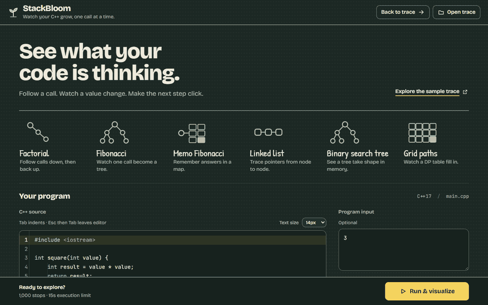

# 🌱 StackBloom

*Watch your C++ grow, one call at a time.*

See how your C++ program runs: follow recursive calls, inspect variables, watch
pointers connect, and step backward when something surprises you. StackBloom
records a real execution under GDB and lets you explore it in your browser.

Built for learning recursion, dynamic programming, and data structures with
single-file C++17 programs. Runs locally; no account needed.

[Get started](#get-started) · [User guide](docs/usage.md) · [Development](docs/development.md)



[View the still preview](docs/recursion-tree.png)

## Get started

Choose **one** option:

| Your setup | Start here |
|---|---|
| Windows, without a development toolchain | Download the portable app below |
| Docker installed | Build and run the container below |
| Working from source | Follow the [Windows or Ubuntu setup](docs/getting-started.md) |

### Windows portable app

1. Download `StackBloom-windows-x64.zip` from [Releases](https://github.com/sumnoon/StackBloom/releases/latest).
   If there is no release asset, check the [Windows build artifacts](https://github.com/sumnoon/StackBloom/actions/workflows/windows-bundle.yml).
2. Extract it to a short path, such as `C:\StackBloom`.
3. Open the extracted folder and double-click **StackBloom.cmd**.

The compiler, debugger, Python, and viewer are included. Your browser opens the
editor. [Windows setup details](docs/getting-started.md#windows)

### Docker

From a checkout of this repository:

```sh
docker build -t stackbloom .
docker run --rm -p 127.0.0.1:8765:8765 stackbloom
```

Open [localhost:8765](http://127.0.0.1:8765).
[Docker options](docs/getting-started.md#docker)

> **Run only code you trust.** StackBloom is not a sandbox. Keep the server local;
> do not expose it through a public port or tunnel.

## Your first run

1. Choose **Fibonacci** in the editor and leave its example input in place.
2. Click **Run & visualize**, then open **Recursion tree**.
3. Press **Step** to follow one stop, or **Play** to watch the calls unfold.
4. Step backward or drag the timeline to revisit a moment.

The highlighted source line is the **next line to execute**. Replay reads the
recording; it does not run your program again.

Once that feels familiar, try **Grid paths** and open **Tables** to watch a DP
table fill, **Memo Fibonacci** to inspect a memo map, or **Linked list** and
open **Memory** to follow pointers.

## Explore at your own pace

| When you want to… | Use… |
|---|---|
| Inspect each call's variables | **Call stack**, with **Watch** to pin a value |
| Understand recursion and returns | **Recursion tree**, with **Predict** to test a guess |
| Find repeated calls | **Repeated work**, which highlights matching call labels |
| Read map/set contents | **Call stack** or **Memory**, with new and changed entries marked |
| See arrays and DP updates | **Tables**, with changed cells and loop-index markers; **Bars** for sorting and searching |
| Follow pointers, aliases, and heap objects | **Memory** |
| Revisit or share a run | The timeline, **Download** for JSON, or **Export** for images and animations |

You do not need every control to get started. The [user guide](docs/usage.md)
covers stepping, graph navigation, predictions, and exports.

## Scope and limitations

- One C++17 source file per run; multi-file projects and custom build flags are not supported.
- Thread creation stops tracing as unsupported.
- STL display depends on the compiler's pretty-printers. Unknown types, pointer
  targets, and initialization states cannot always be resolved.
- Traces have step, time, output, and inspection limits. They show recorded
  observations, not proof that a program is free of undefined behavior.
- Repeated call labels are a heuristic, not proof that results can be memoized.

Read the [execution boundaries](docs/limitations.md) before relying on a trace
for anything beyond exploration.

## Learn more or contribute

- [Installation and startup](docs/getting-started.md)
- [User guide and screenshot tour](docs/usage.md)
- [Development, CLI, and tests](docs/development.md)
- [Architecture and data flow](docs/design.md) · [Trace schema](trace.schema.json) · [Roadmap](docs/roadmap.md)
- [Product principles](PRODUCT.md) · [Visual design system](DESIGN.md)

## License

[GPL-3.0-or-later](LICENSE). Your submitted programs and recorded traces remain
yours. The [allocation recorder](tracer/alloc_ledger.cpp) includes an additional
permission for the code it links into your program. Portable distributions list
bundled dependencies and their sources in `THIRD_PARTY.md`.
