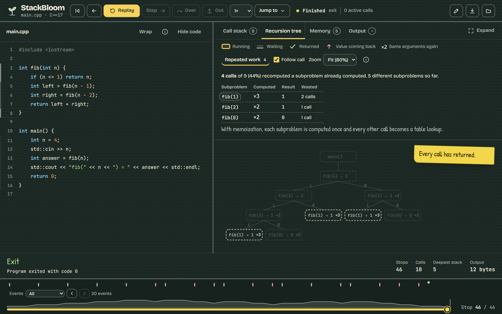
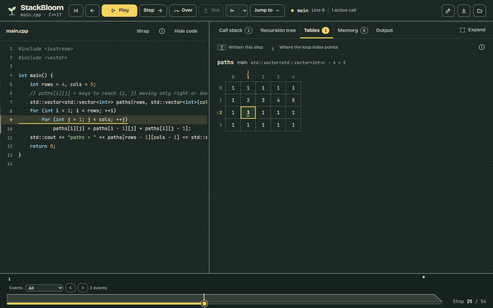
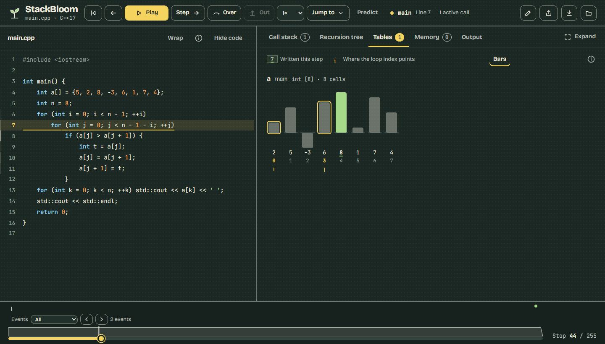
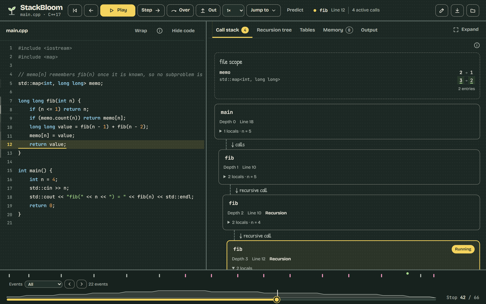
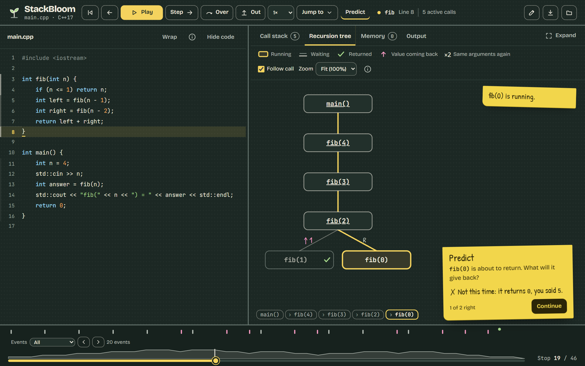
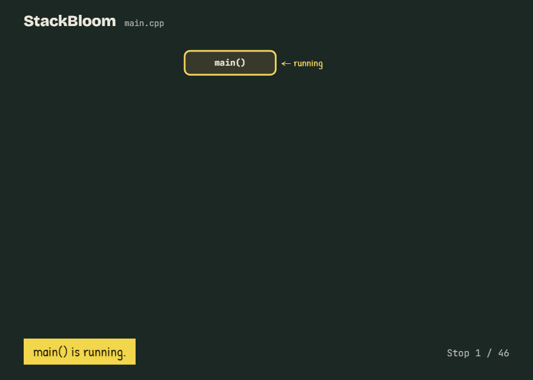

# Using StackBloom

[← Back to StackBloom](../README.md) · [Installation](getting-started.md)

## Your first run

Choose **Fibonacci**, click **Run & visualize**, and open **Recursion tree**.
Start with **Step** and **Previous stop**; use **Play** when you want to watch the
whole sequence. Every stop is before its highlighted source line executes.

## Write and run your program

Paste a single-file C++17 program into **C++ source**. Add **Program input** for
values read by `std::cin`, then click **Run & visualize** in the bottom bar.
Without input, the program reads EOF.

The editor provides C++ highlighting, bracket matching, indentation guides, and
**Text size** controls. Tab indents; Shift+Tab outdents. Press Esc, then Tab, to
move focus out of the editor. Compile errors appear below the source; select one
to jump to its location.

**Execution limits** lets you choose 1,000–5,000 stops and 15–60 seconds. Compilation
has a separate deadline. **Recent runs** keeps the last eight submitted programs
and inputs in this browser. **← Edit code** returns to your current draft.

## Paste a LeetCode solution

Switch the editor to **LeetCode solution** and paste the `class Solution` from the
problem page. In **Test case**, copy the example input as it appears there, either
as `name = value` pairs (`nums = [2,7,11,15], target = 9`) or with one value per line.
StackBloom writes `main()` for you: it builds the arguments, calls the first public
method, and prints the result the way LeetCode does. Methods that return `void`
print the first parameter they modify.

Parameters can be integers, `double`, `bool`, `char`, `string`, `ListNode*`,
`TreeNode*`, and vectors of these. `ListNode` and `TreeNode` are defined for you,
as they are on LeetCode; trees use LeetCode's level order with `null` for gaps.

The recording shows the whole generated file, so you can see how your method
is called. The builders and printers are tagged as a separate file, so the trace
never stops inside them. Compile errors point at lines of your pasted class.
Each mode keeps its own code, so switching back to **Whole program** loses nothing.

## Navigate a recording

| Control | What it does | Shortcut |
|---|---|---|
| Step | Go to the next recorded stop | `s` or → |
| Previous stop | Go back one stop | ← |
| Over | Skip deeper calls to the next stop at this depth or shallower | `n` |
| Out | Advance until the current call leaves the stack | `f` |
| Play / Pause | Replay at the selected speed | Space |

Shortcuts apply outside editing controls. Playback offers 0.5×, 1×, and 2× speeds
and pauses when the page becomes hidden or you seek manually.

Drag the timeline to seek. Its depth graph shows the stack's shape over time;
event markers identify calls, returns, heap changes, output, and issues. Filter
markers or use their previous/next controls to visit matching events.

**Jump to** finds the deepest call, next memory change, or next output. Clicking
a source line number visits its next recorded stop, wrapping to its first stop
if needed.

## Choose a view

### Call stack and watches

Each bubble is one active invocation with its own locals. Values use shorter type
names and readable pointer labels; hover for raw debugger details. Changed locals
show their previous value where the recording supports it. **Watch** pins up to
three variables with value-history charts; click a chart to seek.

A readable value is not necessarily initialized. **Not set yet** is shown where
the available metadata supports that interpretation. See [limitations](limitations.md).

### Recursion tree

Calls branch in invocation order and retain recorded return values. L/R labels
mean first/second child calls, not necessarily `left`/`right` fields. The active
path and step note help you follow the running call.

Select a call to inspect its recorded source location and corresponding stack
frame. Inspection uses a dashed outline and persists across tabs; stepping or
clearing the selection returns to following execution.

**Repeated work** groups matching displayed function-and-argument labels. Select a
row to highlight its copies. After another run, the report compares call counts
with the previous run. This is useful for exploring Fibonacci and memoization,
but matching labels do not prove equivalent computations or measured speedups.

### Tables

Numeric arrays, `std::array`, and vectors appear as grids, including supported
2D tables and file-scope arrays. Changed cells show their previous values on
hover. Indexes named `i`/`j` or `r`/`c` can appear on row/column headers. Try
**Grid paths** to see this in action.

Turn on **Bars** to draw one-dimensional arrays of numbers as bars, which makes
sorting and searching easier to follow. A bar written at this stop turns green;
hover it for the old value. Indexes named `i`, `j`, `k`, `lo`, `hi`, `mid`,
`left` or `right` outline the bar they point at and label it underneath. Negative
values hang below a zero line. The choice is remembered in this browser.

### Maps, sets, and memoization

Supported maps appear as key → value tables and sets as rows of keys, in the call
stack and memory view. New keys and changed values are marked. File-scope tables
and maps have a **file scope** section; supported reference parameters expose their
referred-to contents. Displays are bounded and may omit entries.

Try **Memo Fibonacci**, then compare its call counts with plain Fibonacci using
**Repeated work**. Keep the inputs the same for a useful comparison.

### Memory and output

**Memory** shows bounded heap objects and pointer connections: aliases share a
box, cycles loop back, and known dangling pointers are marked. Layout heuristics
recognize lists, trees, grids, and general graphs.

**Output** shows captured stdout and stderr at the selected stop. Only flushed
output is visible; byte limits can truncate it.

## Make room for the graph

Drag the source divider on wide screens; arrow keys resize it when focused, and
double-click resets it. **Hide code** widens the graph. **Expand** opens fullscreen
with replay controls; restore it to return to the normal workspace.

Graphs fit their panels until labels would become too small, then scroll. Choose
a fixed zoom for details. Disable **Follow call** to pan freely in the recursion
tree. When a graph overflows, **Overview** opens a small map: click to pan, use
arrow keys when the map is focused, or close it with ×. **Wrap** folds long source
lines. Info buttons explain each view in place.

## Predict a return value

Turn on **Predict** to pause before a recorded return and guess its value.
Step, Over, Out, keyboard stepping, and Play can trigger a question. Scrubbing,
Jump to, and line clicks seek directly. Pointer returns are skipped.

## Save and share

- **Download** saves the recording as JSON. Use **Open trace** or drop a trace file
  into the window to reload it. Opening a trace never executes its source.
- **Export** saves the current recursion tree or memory graph as a PNG.
- Export the recursion tree growing as a video or looping GIF. Video uses MP4
  where browser support permits, otherwise WebM.

## Appearance

StackBloom follows the system theme: a slate lecture board in dark mode and a
whiteboard in light mode. Semantic colors are paired with labels and marks, and
motion respects reduced-motion preferences. Fonts ship with the viewer.
